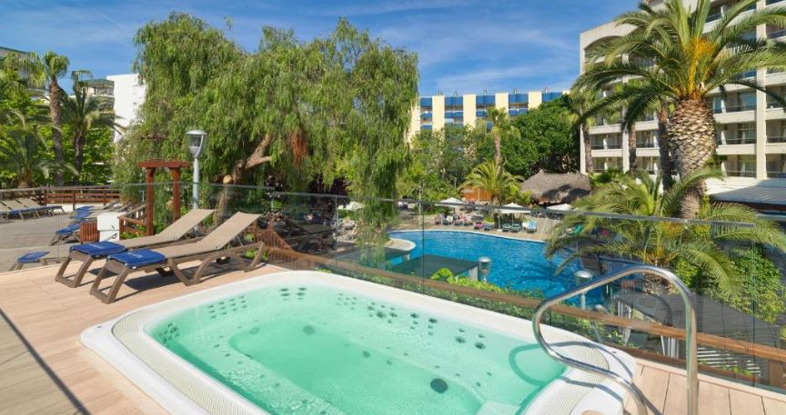
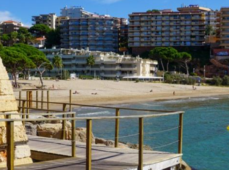

# Iniciativa Salou Travel Hub (STH) 

La iniciativa Salou Travel Hub abreujada també com a STH, busca potenciar, promocionar i

## Dades/continguts (DADES I IMATGES)

En aquest apartat s'explica d'on han estat extretes les dades i les fotografies per a aquesta pàgina web.

 

 

## Estructura de la web
La pàdina web s'estructura en cinc apartats diferents. A continuació s'exposarà l'informació que aporta cadascun dels apartats que conformen la pàgina web:

## Web responsive

## Cartografia

## Dificultats/millores

## Preguntes 

