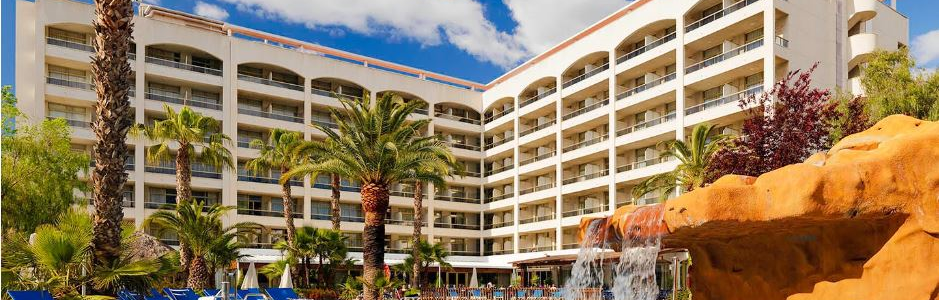
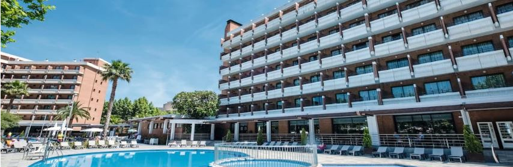

# Iniciativa STH ✈️🏬📌
La iniciativa Salou Travel Hub, abreujada també com a STH, busca potenciar, promocionar i, a la vegada, ubicar els diferents equipaments turístics que es poden trobar al terme municipal de Salou per tal d'oferir als visitants una guia completa de les diferents opcions i ofertes disponibles. A més, el projecte busca mitjançant l'ús de cartografia interactiva, proporcionar informació sobre els diferents establiments turístics de forma categoritzada.

## Motivacions 🏆
El motiu pel qual vaig decidir triar un tema relacionat amb els establiments turístics a Salou ha estat, en primer lloc, perquè trobo interessant les dinàmiques associades al turisme i, en segon lloc, el meu lloc de residència sempre ha estat a Salou. Com ja sabem, el turisme és una peça clau en el desenvolupament econòmic del municipi de manera que vaig trobar interessant realitzar un projecte el qual tractés aquest tema.

## Documentació 📄
La informació exposada a la pàgina web ha estat extreta d'un estudi previ realitzat l'any passat a l'assignatura "Espais i Recursos Turístics". L'estudi en qüestió es basava en l'anàlisi de l'oferta turística al terme municipal de Salou. Bona part de la informació es va extreure de la pàgina web de l'Ajuntament municipal així com d'estudis enfocats en l'anàlisi del turisme a Salou (potencial, oferta, demanda, equipaments, prediccions, fluxos, etc.).

## Imatges 📸
Les imatges presentades a la pàgina web han estat elaboració pròpia. Aprofitant el meu lloc de residència a Salou, he recorregut algunes de les zones més turístiques del municipi per tal de captar a les imatges una representació directa del tema d’estudi que s'exposa a la pàgina web.

  

Esmentar com les sis imatges incloses a l'apartat "Equip" han estat creades a partir d'intel·ligència artificial (IA). Així doncs, la informació ha estat creada per la IA "Artguru" la qual a través d'unes especificacions personals, ha generat unes imatges sobre les diverses modalitats d'experts que han intervingut de forma "fictícia" al projecte.  

  

## Estructura de la web 🗂️
La pàgina web s'estructura en cinc seccions diferents. A continuació, es resumeix breument la informació que s'exposa en cadascun dels apartats:

- **Inici:** És el primer apartat que es mostra una vegada s'obre la pàgina web. En aquesta secció, es dona una breu definició del que entenem per turisme a més d'una breu contextualització de la influència del turisme al municipi en qüestió.

- **Equip:** En aquest segon apartat es presenten els diferents membres que han participat en el projecte. Trobem, per tant, especialistes en diferents àmbits els quals d'acord amb els seus coneixements poden proporcionar una anàlisi i desenvolupament complet de la iniciativa presentada.

- **Projecte:** En aquest tercer aparat s'entra amb molt més detall en què consisteix la iniciativa Salou Travel Hub (STH). També s'exposen els plans futurs als quals s'hauria d'adaptar la iniciativa sempre i quan es faci de manera sostenible.

- **Mapa:** En aquest quart apartat s'explica l'oferta turística per seccions que ofereix el municipi i seguidament, es troba un mapa interactiu el qual mostra els diferents establiments hotelers i càmpings de forma categoritzada (s'indica el nivell dels establiments). L'usuari pot en tot moment interactuar amb el mapa i cercar els establiments turístics que estiguin dins de les seves preferències o possibilitats.

- **Contactes:** En aquest cinquè i últim apartat es mostra una secció la qual permet als usuaris contactar directament amb els responsables del projecte. Així doncs, aquesta interacció es pot realitzar sempre que s'ompli la informació personal bàsica (nom, cognoms, correu, motius).

## Aspectes tècnics generals 📘
En aquest apartat s'exposen aspectes tècnics generals essencials per al correcte desenvolupament de la pàgina web. Així doncs, seguidament es detallaran els processos tècnics que s'han realitzat amb HTML, CSS i JavaScript per a la creació de la barra d'eines i el peu de pàgina.

Començant amb el peu de pàgina, destacar primerament, com s'ha creat una línia la qual defineix un "div" que conté la barra de navegació. La classe "topnav"i la ID "myTopnav" s'utilitzen per aplicar estils específics a través de CSS i també, per fer referència a aquest "div" en scripts propis de JavaScript.

```
 <div class="topnav" id="myTopnav">
```

Seguidament, es troben els enllaços de navegació els quals cadascun d'aquests apunta a una pàgina diferent del lloc web.

```
 <a href="index.html">Inici</a>
    <a href="equipo.html">Equip</a>
    <a href="proyectos.html">Projecte</a>
    <a href="mapa.html" class="active">Mapa</a>
    <a href="contacto.html">Contacte</a>
```

Finalment, trobem un enllaç que s'utilitza per crear una icona de menú desplegable, la qual és utilitzada en interfases d'usuaris adaptades a dispositius mòbils.

```
<a href="javascript:void(0);" class="icon" onclick="myFunction()">
      <i class="fa fa-bars"></i>
    </a>
  </div>
```

Pel que fa el peu de pàgina esmentar com primerament es defineix la secció del peu de pàgina (footer). La classe footer es pot utilitzar per aplicar estils específics a aquesta secció a través de CSS. Dins de "footer", tenim un contenidor (footer-contenidor) el qual agrupa totes les seccions del peu de pàgina.

```
 <footer class="footer"
    <div class="footer-container">
```

A continuació, es mostra la secció on es va colocar el logotip de l'empresa o institució. L'etiqueta "figure" s'utilitza per marcar el contingut que està relacionat visualment (com una imatge). Dins de "figure" hi ha un enllaç, que actualment no apunta a cap pàgina específica. A l'enllaç, hi ha una imatge la qual mostra el logotip de la URV.

```
<div class="footer-section logo-section">
        <figure>
          <a href="#">
            
          </a>
        </figure>
      </div>
```

Aquesta secció proporciona informació sobre l'empresa. Té un títol anomenat "Sobre Nosaltres", un paràgraf descrivint l'empresa i un altre paràgraf amb informació de contacte.

```
<div class="footer-section about-section">
        <h2>Sobre Nosaltres</h2>
        <p>Som una empresa compromesa amb la qualitat i la innovació.</p>
        <p>Contacte: 977 777 666</p>
      </div>
```

També es va afegir una secció la qual conté enllaços a les xarxes socials de l'empresa. Cada enllaç té una classe que probablement correspon a icones de fonts, que mostraran les icones de les respectives xarxes socials.

```
 <div class="footer-section social-section">
        <h2>Segueix-nos</h2>
        <div class="social-links">
          <a href="https://www.facebook.com/" class="fa fa-facebook"></a>
          <a href="https://www.instagram.com/" class="fa fa-instagram"></a>
          <a href="https://twitter.com/" class="fa fa-twitter"></a>
          <a href="https://www.youtube.com/" class="fa fa-youtube"></a>
        </div>
      </div>
    </div>
```

La secció "footer-bottom" conté una línia de text petit "small" la qual s'encarrega d'esmentar els drets d'autor i el nom del titular del projecte.

```
  <div class="footer-bottom">
      <small>&copy; 2024 <b>Marc Martinez Dylong</b>.</small>
    </div>
```

Aquest botó, quan es fa clic, crida a la funció "scrollToTop()", que probablement es troba definida en un arxiu JavaScript extern. El botó té una icona de fletxa cap amunt, indicant per tant, el seu propòsit.

```
<button onclick="scrollToTop()" id="scrollToTopBtn" title="Go to top"><i class="arrow up"></i></button> <!-- Botó de retorn a dalt -->
```

Finalment, s'inclou un arxiu JavaScript "(js/*map.js)" que s'encarrega de quan la pàgina s'obre. Aquest script pot contenir la funcionalitat de la pàgina, com per exemple la definició de la funció "scrollToTop()".

```
<script src="js/map.js"></script>
</body>
</html>
```

## Web responsive 💻📲

## Cartografia 🗺️
La cartografia ha estat realitzada amb l'ajuda del programa QGIS. En aquest, s'ha digitalitzat els diferents establiments hotelers i càmpings que es poden trobar al municipi de Salou. Així doncs, al QGIS es van crear dues capes de punts on en aquestes, els punts van estar reemplaçats per dues imatges SVG diferents. Destacar com les capes de fons sobre les quals s'ha realitzat la digitalització són de pròpies de ESRI (un és un mapa topogràfic i l'altra una imatge satèl·lit).

## Dificultats/Millores ⚖️
La realització de la pàgina web ha estat un procés molt enriquidor, però des del meu punt de vista, ha estat també un procés complex dins de les meves capacitats. Anteriorment a aquest projecte, mai havia utilitzat cap llenguatge de programació. A continuació, he volgut exposar tres dificultats que he tingut amb la creació de la pàgina web i, també, tres millores que es podrien fer per tal de millorar aquesta.

**Dificultats:**

1. He tingut seriosos problemes respecte a la integració del mapa a la pàgina web. Al principi em sortia un error el qual no em permetia visualitzar la llegenda (càmpings, establiments i capes). Tot i això, el problema el vaig resoldre i el resultat trobo que ha estat bastant acceptable dins dels meus coneixements.

2. A l'hora de crear la barra de navegació, he tingut problemes amb aquesta i és que el problema no vaig ser capaç de corregir-lo. Quan s'accedeix a la pàgina web, segons la secció en la qual ens trobem, la barra adopta un format diferent (en alguns casos és més gran i en altres és més petita).

3. Vaig tindre dificultats amb la posició de les imatges, en molts dels casos, simplement no quedaven ben posicionades. Tot i que el problema es troba solucionat, crec que en alguns casos les imatges no acaben d’estar ben posicionades (a la secció “Equip” l’espai entre imatges és molt reduït).

**Millores:**

1. Es podria haver redactat el text amb un major detall oferint un ampli ventall de possibilitats. A més, al mapa es podrien haver identificat els bars, restaurants i botigues comercials que es troben al municipi a banda dels establiments hotelers i càmpings ja representats en aquest.

2. La gran majoria de les imatges malgrat realitzar-les en un format amb alta definició, a l'hora d'exportar-les a la pàgina web han experimentat una pèrdua considerable de la seva qualitat. Seria millorable sí les imatges es trobessin inserides en un format amb alta definició millorant així l’experiència.

3. Les imatges generades amb intel·ligència artificial podrien haver estat reemplaçades directament per imatges reals, aportant d'aquesta manera un toc més professional a la pàgina web. 

## Autor 📝
- **Marc Martínez Dylong:** _Creació de la pàgina web._

## Agraiments 🎁
- **Oriol Boronat:** _Documentació extreta del treball inical realitzat._
- **Zaira González:** _Valoració del apartat estètic de la pàgina web._
- **Carlos Soriano:** _Professor de l'assignatura Producció i Disseny Cartogràfic. Eines Web._
- **Benito Zaragozí:** _Professor de l'assignatura Producció i Disseny Cartogràfic. Eines Web._
 
